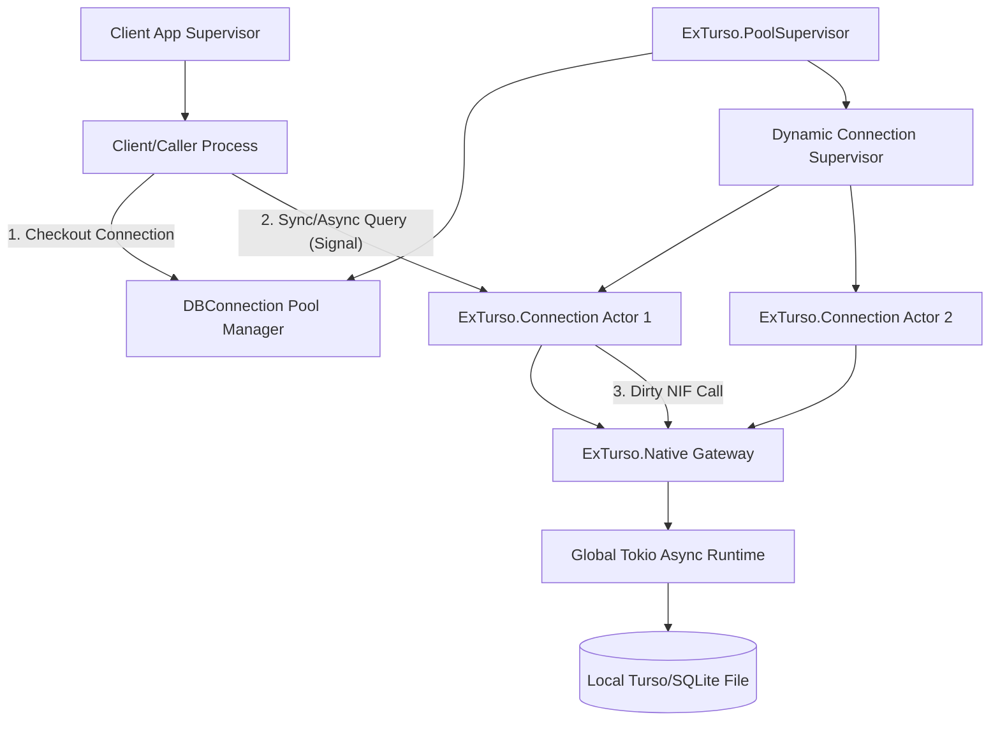

# Agent Architecture (Actor Model Model Specifications)

This document describes the architecture of `ExTurso` modeled as a set of discrete, concurrent actors (agents) adhering to the **Actor Model** design pattern. The system leverages the Erlang/Elixir BEAM runtime, where processes act as isolated agents communicating exclusively via message passing, maintaining immutable states, and managed by supervisor trees.

---

## 1. High-Level Actor Architecture

The `ExTurso` system is organized into a supervisor-worker tree, isolating the client caller, pool orchestrators, connection workers, and the external C/Rust database interfaces.



---

## 2. Actor Model Specifications

### Actor 1: `ExTurso.PoolSupervisor` (Orchestrator)

*   **Role:** Orchestrator
*   **Purpose:** Manages the lifecycle of connection actors and coordinates the connection pool registry. It ensures that the required number of database connections is maintained and restarted when necessary.
*   **Input/Output Schema (Signals):**
    *   **Incoming Signals:**
        *   `{:start_link, opts}`: Initialization command with configuration parameters (e.g. `:database`, `:pool_size`).
        *   `{:EXIT, pid, reason}`: Trapped exit signals indicating a child connection actor has crashed.
    *   **Outgoing Signals:**
        *   `{:ok, supervisor_pid}`: Successful startup acknowledgment.
        *   Lifecycle commands (`start_child`, `terminate_child`) sent to the connection pool supervisor.
*   **Supervision Strategy:**
    *   Uses a `:one_for_all` or `:one_for_one` supervision strategy (orchestrated via `DBConnection`).
    *   **Restart Intensity:** Maximum of 3 restarts within a 5-second window.
    *   **Cascading Crash:** If the pool supervisor exceeds its restart intensity (e.g. due to persistent database file permissions errors), it crashes, propagating the failure up the application tree (Let it Crash).
*   **Failure Modes & Recovery:**
    *   *Worker Crash:* Automatically detects crashed `ExTurso.Connection` actors via trapped exits and spawns clean replacement connection processes.
    *   *Invalid Configuration:* If starting parameters are invalid (e.g. file path does not exist and database is read-only), startup will fail immediately, preventing the application from running in a corrupted state.

---

### Actor 2: `ExTurso.Connection` (Gateway & Worker)

*   **Role:** Worker / Gateway (Interface to Database Resource)
*   **Purpose:** A stateful process representing a single, persistent connection to the Turso database. It holds the NIF resources (immutable database/connection references) and serializes execution requests.
*   **Input/Output Schema (Signals):**
    *   **Incoming Signals:**
        *   `connect(opts)`: Instantiates a database connection NIF reference.
        *   `checkout(state)`: Verifies if the actor is free to serve requests.
        *   `handle_execute(query, params, opts, state)`: Evaluates an SQL write or modification statement.
        *   `handle_prepare(query, opts, state)`: Prepares a statement (no-op in ExTurso).
        *   `handle_begin(opts, state)`: Initiates a transaction block (`BEGIN`).
        *   `handle_commit(opts, state)`: Finalizes a transaction (`COMMIT`).
        *   `handle_rollback(opts, state)`: Aborts a transaction (`ROLLBACK`).
        *   `disconnect(err, state)`: Tears down the connection handle.
    *   **Outgoing Signals:**
        *   `{:ok, %ExTurso.Connection{}}`: Connection established successfully.
        *   `{:ok, query, %ExTurso.Result{}, new_state}`: Execution completed successfully.
        *   `{:error, %ExTurso.Error{}, state}`: Statement execution failed, state remains intact.
        *   `{:disconnect, %ExTurso.Error{}, state}`: Connection encountered an unrecoverable failure (e.g., IO error); actor requests termination.
*   **State Management:**
    *   State is represented as an immutable snapshot struct:
        ```elixir
        %ExTurso.Connection{
          db: reference(),     # NIF Database resource pointer
          conn: reference(),   # NIF Connection resource pointer
          status: :idle | :transaction
        }
        ```
    *   State transitions are executed via pure state-transforming functions (`handle_begin/2`, `handle_commit/2`, `handle_rollback/2`) returning the tuple `{:ok, result, new_state}`.
*   **Supervision Strategy:**
    *   Supervised dynamically under the connection pool. If an error is returned as `{:disconnect, reason, state}`, the process exits normally or abnormally, triggering the supervisor to replace it.
*   **Failure Modes & Recovery:**
    *   *I/O Error / Corruption (`:io`, `:corrupt` error codes):* Returns a `{:disconnect, ...}` signal to the pool manager, terminating the actor. The pool supervisor spawns a new connection actor which attempts a fresh NIF `open/1` and `connect/1`. Transaction-control failures (`BEGIN`/`COMMIT`/`ROLLBACK`) also disconnect, since the transaction state is indeterminate.
    *   *Bad SQL Syntax / Constraint Violation / Database Busy:* Returns `{:error, %ExTurso.Error{code: ...}}` to the caller. The actor's state remains intact and it continues processing subsequent queries from the mailbox. `:busy` errors are retryable by the caller.

---

### Actor 3: `ExTurso.Native` (Gateway to Native Runtime)

*   **Role:** Gateway
*   **Purpose:** Exposes native Rustler bindings (`native/ex_turso`) executing Turso/libsql queries. It bridges the BEAM scheduler environment and the native OS/Tokio scheduler.
*   **Input/Output Schema (Signals):**
    *   **Incoming Signals (from Connection Actor):**
        *   `open(path)`: Invokes local database initialization.
        *   `connect(db_resource)`: Spawns a connection session.
        *   `query(conn_resource, sql, params)`: Runs an SQL read query.
        *   `execute(conn_resource, sql, params)`: Runs an SQL write execution.
        *   `close(conn_resource)`: Flushes database cache.
    *   **Outgoing Signals (to Connection Actor):**
        *   `{:ok, db_ref}` | `{:error, {code_atom, reason_str}}`
        *   `{:ok, conn_ref}` | `{:error, {code_atom, reason_str}}`
        *   `{:ok, rows_list}` | `{:error, {code_atom, reason_str}}`
        *   `{:ok, affected_rows}` | `{:error, {code_atom, reason_str}}`
        *   `:ok`
        *   `code_atom` classifies the failure (`:busy`, `:constraint`, `:io`, `:corrupt`, `:misuse`, `:invalid_param`, `:error`) so the connection actor can decide between `{:error, ...}` and `{:disconnect, ...}`.
*   **Supervision Strategy:**
    *   Native code execution takes place in dirty I/O schedulers (`DirtyIo`), keeping the main Erlang schedulers free from async blockage.
    *   Lifetime of NIF resources (`DbResource`, `ConnResource`) is tied directly to the BEAM Garbage Collector via `ResourceArc` wrapping.
*   **Failure Modes & Recovery:**
    *   *Rust Panic / Segfault:* If the NIF crashes unexpectedly, it can crash the entire BEAM Virtual Machine. Mitigated by isolating database operations to dedicated nodes in a distributed architecture, allowing cluster orchestration (e.g. Kubernetes, Nomad) or node monitors to reboot the node.
    *   *Tokio Worker Blockage:* Guarded by offloading runtime calls to a dedicated, global Tokio runtime.

---

### Actor 4: `Client / Caller Process` (Worker)

*   **Role:** Worker (Requestor)
*   **Purpose:** The application-specific process (e.g., Phoenix Controller, LiveView, Task, or Cron Worker) that initiates database read/write requests.
*   **Input/Output Schema (Signals):**
    *   **Incoming Signals:** Application triggers (e.g., HTTP request, user action).
    *   **Outgoing Signals:**
        *   `ExTurso.query(pool_name, sql, params)`
        *   `ExTurso.execute(pool_name, sql, params)`
*   **Supervision Strategy:**
    *   Supervised by the client application's OTP tree.
*   **Failure Modes & Recovery:**
    *   *Connection Timeout:* If the pool is exhausted, the client blocks until a timeout occurs, raising a `DBConnection.ConnectionError`. The client catches this error to return a `503 Service Unavailable` response, or crashes (Let it Crash) to be restarted.

---

## 3. Communication Patterns

1.  **Asynchronous Mailbox Queuing:**
    All connection checkout requests and execution payloads are handled via asynchronous mailbox queues native to BEAM processes. Multiple clients can send queries concurrently; they are queued and executed sequentially by each independent `ExTurso.Connection` worker.
2.  **No Shared State:**
    State isolation is strictly enforced. The database connection references (`db` and `conn`) are pointers owned exclusively by a single `ExTurso.Connection` process. No two processes share the same connection handle, avoiding thread safety issues and race conditions.
3.  **Synchronous Handshakes:**
    While DBConnection manages the pool asynchronously under the hood, queries from caller processes block synchronously waiting for the database response to maintain consistency and transaction integrity.

---

## 4. Technical Constraints & Distributed Considerations

*   **Nix-Based Environments:**
    The codebase assumes a Nix-based build pipeline where the Rust toolchain and Libsql libraries are present. Since Elixir builds are distributed, the compiled NIFs are packaged within target releases.
*   **Location Transparency:**
    Using Elixir's registry or distributed Erlang, queries can be executed against a registered pool name (`MyApp.DB`) located on any node within the BEAM cluster, routing messages transparently across the network.
*   **Fault Tolerance (Let it Crash):**
    No complex error-recovery loops exist within query callers. If a network partition occurs or a disk failure is encountered, the connection actor simply exits, prompting the supervisor to restore it once conditions normalize.
